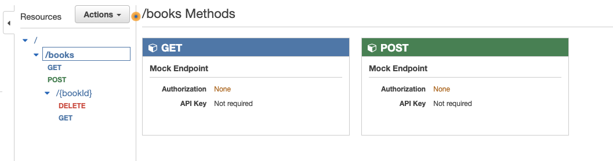
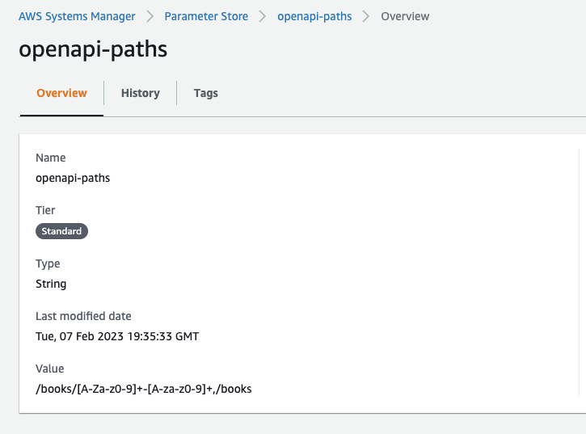
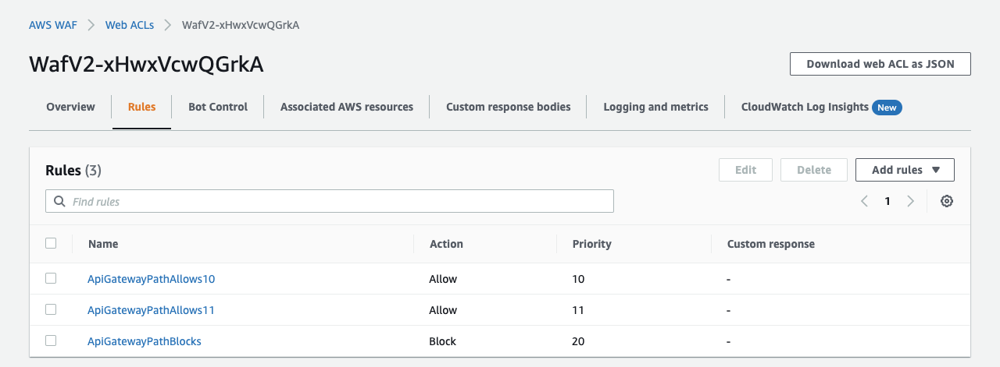

## Generate dynamic WAF rules from deployed API Gateway endpoints

### Problem statement
Many WAF rule implementations 'Block' a hard-coded list of static endpoints and then 'Allow' anything else.

To minimise attack surfaces, it is advisable to lockdown WAF rules to 'Allow' only specified application URIs and then 'Block' everything else.

However, hard-coded (static) WAF rules also couple your infrastructure to the codebase so are best avoided.

### Solution statement
The following example CDK implementation deploys a dummy API Gateway REST API to AWS.

On CDK deployment, a Lambda Trigger Function writes the deployed API REST endpoints URIs to AWS Systems Manager Parameter Store.

A subsequent stack, deployed with a dependency, then reads these endpoints from Parameter Store and builds WAF rules to 'Allow' what is deployed and 'Block' everything else.

### CDK Components
This example repo consists of the following CDK components.

###### Rest API stack
- Dummy API Gateway REST API 

- TriggerFunction to invoke an AWS Lambda function during deployment
- Lambda function to capture and store API endpoints in AWS Systems Manager Parameter Store

###### Frontend stack
- Reads API endpoint paths from AWS Systems Manager Parameter Store
- Creates an associated Regional WAF ACL
- Creates a list of 'Allow' WAF rules matching each '/books/**' endpoint
- Creates 'Block' WAF rule for all other '/' endpoints

### Prerequisites
- Sign up for an AWS account (this example will deploy to free-tier if destroyed shortly afterwards) 
- ([Best practice](https://docs.aws.amazon.com/accounts/latest/reference/best-practices-root-user.html)) Enable MFA for the root user
- ([Best practice](https://docs.aws.amazon.com/IAM/latest/UserGuide/access_policies_job-functions.html#jf_developer-power-user)) Create a user group with the pre-defined Developer power user job function 'PowerUserAccess' permissions and associate a user with access key credentials
- Store these access key credentials in `~/.aws/credentials`

### Deploy this example

* `npm install`       install node package dependencies 
* `npm run build`     compile typescript to js
* `cdk deploy --all`  deploy all stacks to your default AWS account/region
* `cdk destroy --all` destroy all stacks in your default AWS account/region

### Additional useful commands

* `npm run clean`     clean project
* `npm run watch`     watch for changes and compile
* `npm run test`      perform the jest unit tests
* `npm run test:update-snapshot` update any jest unit test snapshots
* `cdk diff`          compare deployed stack with current state
* `cdk synth`         emits the synthesized CloudFormation template
